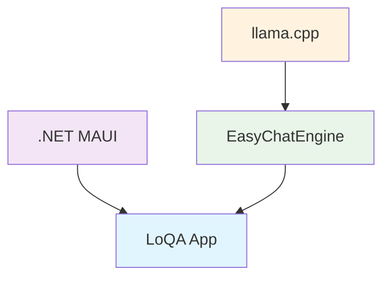

<div align="center">
  
<h1>LoQA</h1>

  
  **Local Question Answer**
  
  *A simple, offline, cross-platform AI chat application*
  

</div>

---

## 🎯 Philosophy

LoQA is built on three core principles that make AI accessible to everyone:

> **🏠 Local First** • All models and conversations are stored and processed on your device. No internet connection required for chatting.

> **🌐 Cross-Platform** • A single codebase delivers a native experience on both Windows and Android.

> **♿ Accessibility** • Designed to run efficiently on standard consumer hardware, from your PC to your phone.

---

## 🚀 See LoQA in Action

<table align="center">
  <tr>
    <td align="center">
      <h3>📱 Android Demo</h3>
      <video src="https://github.com/user-attachments/assets/6ba8d4dc-4665-4ce0-8831-3dd1cd168759" 
             controls muted autoplay loop style="max-width:100%; border-radius: 8px;">
        Your browser does not support the video tag.
      </video>
    </td>
  </tr>
  <tr>
    <td align="center">
      <h3>💻 Windows Demo</h3>
      <video src="https://github.com/user-attachments/assets/6d5cb8dc-3a2f-4e30-9c1f-7921dba416f8" 
             controls muted autoplay loop style="max-width:100%; border-radius: 8px;">
        Your browser does not support the video tag.
      </video>
    </td>
  </tr>
</table>

---

## ⚡ Features

<div align="center">

| Feature | Description |
|---------|-------------|
| **🦙 llama.cpp Powered** | Supports a wide range of GGUF models with flexible size and capability options |
| **🔒 Offline Operation** | Your chats and models are processed entirely locally |
| **📱💻 Cross-Platform** | Seamless experience on Windows and Android |
| **🔧 Model Management** | Easy GGUF file addition, configuration, and model switching |
| **💾 Conversation History** | Automatic chat saving to local SQLite database |
| **🎛️ Parameter Control** | Real-time adjustment of sampling parameters like temperature |
| **⚙️ Advanced Settings** | Customize context size (CTX) and GPU layer allocation |

</div>

---

## 🏗️ Built With

<div align="center">



</div>

- **🎨 .NET MAUI** - Cross-platform UI framework
- **⚡ EasyChatEngine** - Custom C++ wrapper for simplified llama.cpp integration
- **🚀 llama.cpp** - High-performance GGUF model inference engine

---

## 🛠️ Build Instructions

### Prerequisites

- 📦 .NET 9 SDK or later
- 🎯 Visual Studio 2022 with ".NET Multi-platform App UI development" workload

### Step 1: Build the Native Engine

```bash
# Clone the engine repository
git clone https://github.com/a-s-l-a-h/easychatengine.git

# Follow the build instructions in that repository's README
# to compile native libraries for your target platforms
```

### Step 2: Place Compiled Binaries

Copy the resulting library files to the correct platform folders:

#### Windows (x64)
```
LoQA/Platforms/Windows/libs/x64/
├── easychatengine.dll
├── llama.dll
└── ... (other .dll files)
```

#### Android (arm64-v8a)
```
LoQA/Platforms/Android/libs/arm64-v8a/
├── libeasychatengine.so
├── libllama.so
└── ... (other .so files)
```

### Step 3: Build LoQA

1. Open `LoQA.sln` in Visual Studio 2022
2. Select your target platform (Windows Machine or Android device)
3. Build and run the project

---

## 📖 Quick Start Guide

<div align="center">

### 🎯 Get Started in 5 Easy Steps

</div>

| Step | Action | Details |
|------|--------|---------|
| **1️⃣** | **Download Model** | Get a GGUF model from [Hugging Face Hub](https://huggingface.co/models?pipeline_tag=text-generation&library=gguf&apps=llama.cpp&sort=trending) |
| **2️⃣** | **Launch LoQA** | Start the application on your device |
| **3️⃣** | **Add Model** | Sidebar → **Models** → **+ Add Model** → Select your GGUF file |
| **4️⃣** | **Load Model** | Click the **Load** button next to your model |
| **5️⃣** | **Start Chatting** | Click **+ New Chat** and begin your conversation! |

---

## 📁 Project Architecture
```
📁 LoQA/
├── 🔧 Services/
│ ├── EasyChatEngine.cs # C# wrapper for the native C++ engine
│ ├── EasyChatService.cs # Core application logic for chat operations
│ └── DatabaseService.cs # Handles local SQLite database for conversations
│
├── 🎨 Views/
│ ├── ChatContentPage.xaml # UI for the main chat interface
│ ├── ModelsPage.xaml # UI for adding, configuring, and managing models
│ └── ... # Other UI pages and controls
│
└── 📱 Platforms/
├── Windows/libs/x64/
│ └── 💻 .dll files (e.g., easychatengine.dll, llama.dll)
│
└── Android/libs/arm64-v8a/
└── 📱 .so files (e.g., libeasychatengine.so, libllama.so)
```
