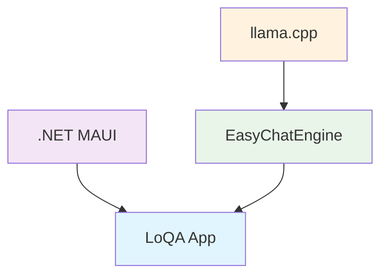

# <div align="center">
  <svg width="200" height="100" xmlns="http://www.w3.org/2000/svg">
    <defs>
      <filter id="textShadow" x="-50%" y="-50%" width="200%" height="200%">
        <feDropShadow dx="2" dy="2" stdDeviation="2" flood-color="rgba(255,255,255,0.3)" />
      </filter>
    </defs>
    <rect width="100%" height="100%" fill="#1a1a1a"/>
    <text x="50%" y="50%" dominant-baseline="middle" text-anchor="middle"
          font-family="Arial, sans-serif" font-size="48" font-weight="bold"
          fill="white" filter="url(#textShadow)">
      LoQA
    </text>
  </svg>
  
  **Local Question Answer**
  
  *A simple, offline, cross-platform AI chat application*
  

</div>

---

## 🎯 Philosophy

LoQA is built on three core principles that make AI accessible to everyone:

> **🏠 Local First** • All models and conversations are stored and processed on your device. No internet connection required for chatting.

> **🌐 Cross-Platform** • A single codebase delivers a native experience on both Windows and Android.

> **♿ Accessibility** • Designed to run efficiently on standard consumer hardware, from your PC to your phone.

---

## 🚀 See LoQA in Action

<table align="center">
  <tr>
    <td align="center" width="50%">
      <h3>📱 Android Demo</h3>
      <video src="https://github.com/user-attachments/assets/6ba8d4dc-4665-4ce0-8831-3dd1cd168759" 
             controls muted autoplay loop style="max-width:100%; border-radius: 8px;">
        Your browser does not support the video tag.
      </video>
    </td>
    <td align="center" width="50%">
      <h3>💻 Windows Demo</h3>
      <video src="https://github.com/user-attachments/assets/6d5cb8dc-3a2f-4e30-9c1f-7921dba416f8" 
             controls muted autoplay loop style="max-width:100%; border-radius: 8px;">
        Your browser does not support the video tag.
      </video>
    </td>
  </tr>
</table>

---

## ⚡ Features

<div align="center">

| Feature | Description |
|---------|-------------|
| **🦙 llama.cpp Powered** | Supports a wide range of GGUF models with flexible size and capability options |
| **🔒 Offline Operation** | Your chats and models are processed entirely locally |
| **📱💻 Cross-Platform** | Seamless experience on Windows and Android |
| **🔧 Model Management** | Easy GGUF file addition, configuration, and model switching |
| **💾 Conversation History** | Automatic chat saving to local SQLite database |
| **🎛️ Parameter Control** | Real-time adjustment of sampling parameters like temperature |
| **⚙️ Advanced Settings** | Customize context size (CTX) and GPU layer allocation |

</div>

---

## 🏗️ Built With

<div align="center">



</div>

- **🎨 .NET MAUI** - Cross-platform UI framework
- **⚡ EasyChatEngine** - Custom C++ wrapper for simplified llama.cpp integration
- **🚀 llama.cpp** - High-performance GGUF model inference engine

---

## 🛠️ Build Instructions

### Prerequisites

- 📦 .NET 9 SDK or later
- 🎯 Visual Studio 2022 with ".NET Multi-platform App UI development" workload

### Step 1: Build the Native Engine

```bash
# Clone the engine repository
git clone https://github.com/a-s-l-a-h/easychatengine.git

# Follow the build instructions in that repository's README
# to compile native libraries for your target platforms
```

### Step 2: Place Compiled Binaries

Copy the resulting library files to the correct platform folders:

#### Windows (x64)
```
LoQA/Platforms/Windows/libs/x64/
├── easychatengine.dll
├── llama.dll
└── ... (other .dll files)
```

#### Android (arm64-v8a)
```
LoQA/Platforms/Android/libs/arm64-v8a/
├── libeasychatengine.so
├── libllama.so
└── ... (other .so files)
```

### Step 3: Build LoQA

1. Open `LoQA.sln` in Visual Studio 2022
2. Select your target platform (Windows Machine or Android device)
3. Build and run the project

---

## 📖 Quick Start Guide

<div align="center">

### 🎯 Get Started in 5 Easy Steps

</div>

| Step | Action | Details |
|------|--------|---------|
| **1️⃣** | **Download Model** | Get a GGUF model from [Hugging Face Hub](https://huggingface.co/models?pipeline_tag=text-generation&library=gguf&apps=llama.cpp&sort=trending) |
| **2️⃣** | **Launch LoQA** | Start the application on your device |
| **3️⃣** | **Add Model** | Sidebar → **Models** → **+ Add Model** → Select your GGUF file |
| **4️⃣** | **Load Model** | Click the **Load** button next to your model |
| **5️⃣** | **Start Chatting** | Click **+ New Chat** and begin your conversation! |

---

## 📁 Project Architecture

<div align="center">

<svg width="800" height="600" xmlns="http://www.w3.org/2000/svg">
  <defs>
    <linearGradient id="folderGrad" x1="0%" y1="0%" x2="100%" y2="100%">
      <stop offset="0%" style="stop-color:#4CAF50;stop-opacity:1" />
      <stop offset="100%" style="stop-color:#2E7D32;stop-opacity:1" />
    </linearGradient>
    <linearGradient id="serviceGrad" x1="0%" y1="0%" x2="100%" y2="100%">
      <stop offset="0%" style="stop-color:#2196F3;stop-opacity:1" />
      <stop offset="100%" style="stop-color:#1976D2;stop-opacity:1" />
    </linearGradient>
    <linearGradient id="viewGrad" x1="0%" y1="0%" x2="100%" y2="100%">
      <stop offset="0%" style="stop-color:#FF9800;stop-opacity:1" />
      <stop offset="100%" style="stop-color:#F57C00;stop-opacity:1" />
    </linearGradient>
    <linearGradient id="platformGrad" x1="0%" y1="0%" x2="100%" y2="100%">
      <stop offset="0%" style="stop-color:#9C27B0;stop-opacity:1" />
      <stop offset="100%" style="stop-color:#7B1FA2;stop-opacity:1" />
    </linearGradient>
    <filter id="shadow">
      <feDropShadow dx="2" dy="2" stdDeviation="2" flood-opacity="0.3"/>
    </filter>
  </defs>
  
  <!-- Background -->
  <rect width="100%" height="100%" fill="#1a1a1a" rx="10"/>
  
  <!-- Root folder -->
  <rect x="50" y="40" width="120" height="40" fill="url(#folderGrad)" rx="5" filter="url(#shadow)"/>
  <text x="110" y="65" text-anchor="middle" fill="white" font-family="Arial" font-size="16" font-weight="bold">📁 LoQA</text>
  
  <!-- Services folder -->
  <line x1="170" y1="60" x2="220" y2="60" stroke="#666" stroke-width="2"/>
  <line x1="220" y1="60" x2="220" y2="140" stroke="#666" stroke-width="2"/>
  <line x1="220" y1="140" x2="250" y2="140" stroke="#666" stroke-width="2"/>
  
  <rect x="250" y="120" width="140" height="40" fill="url(#serviceGrad)" rx="5" filter="url(#shadow)"/>
  <text x="320" y="145" text-anchor="middle" fill="white" font-family="Arial" font-size="14" font-weight="bold">🔧 Services</text>
  
  <!-- Service files -->
  <rect x="420" y="100" width="180" height="25" fill="#1565C0" rx="3"/>
  <text x="430" y="117" fill="white" font-family="Arial" font-size="12">EasyChatEngine.cs</text>
  <text x="620" y="117" fill="#90CAF9" font-family="Arial" font-size="10">C# wrapper</text>
  
  <rect x="420" y="130" width="180" height="25" fill="#1565C0" rx="3"/>
  <text x="430" y="147" fill="white" font-family="Arial" font-size="12">EasyChatService.cs</text>
  <text x="620" y="147" fill="#90CAF9" font-family="Arial" font-size="10">App logic</text>
  
  <rect x="420" y="160" width="180" height="25" fill="#1565C0" rx="3"/>
  <text x="430" y="177" fill="white" font-family="Arial" font-size="12">DatabaseService.cs</text>
  <text x="620" y="177" fill="#90CAF9" font-family="Arial" font-size="10">SQLite DB</text>
  
  <!-- Views folder -->
  <line x1="220" y1="220" x2="250" y2="220" stroke="#666" stroke-width="2"/>
  
  <rect x="250" y="200" width="140" height="40" fill="url(#viewGrad)" rx="5" filter="url(#shadow)"/>
  <text x="320" y="225" text-anchor="middle" fill="white" font-family="Arial" font-size="14" font-weight="bold">🎨 Views</text>
  
  <!-- View files -->
  <rect x="420" y="180" width="180" height="25" fill="#F57C00" rx="3"/>
  <text x="430" y="197" fill="white" font-family="Arial" font-size="12">ChatContentPage.xaml</text>
  <text x="620" y="197" fill="#FFB74D" font-family="Arial" font-size="10">Main chat</text>
  
  <rect x="420" y="210" width="180" height="25" fill="#F57C00" rx="3"/>
  <text x="430" y="227" fill="white" font-family="Arial" font-size="12">ModelsPage.xaml</text>
  <text x="620" y="227" fill="#FFB74D" font-family="Arial" font-size="10">Model UI</text>
  
  <rect x="420" y="240" width="180" height="25" fill="#F57C00" rx="3"/>
  <text x="430" y="257" fill="white" font-family="Arial" font-size="12">...</text>
  <text x="620" y="257" fill="#FFB74D" font-family="Arial" font-size="10">Other UI</text>
  
  <!-- Platforms folder -->
  <line x1="220" y1="320" x2="250" y2="320" stroke="#666" stroke-width="2"/>
  
  <rect x="250" y="300" width="140" height="40" fill="url(#platformGrad)" rx="5" filter="url(#shadow)"/>
  <text x="320" y="325" text-anchor="middle" fill="white" font-family="Arial" font-size="14" font-weight="bold">📱 Platforms</text>
  
  <!-- Platform subfolders -->
  <rect x="420" y="280" width="200" height="25" fill="#7B1FA2" rx="3"/>
  <text x="430" y="297" fill="white" font-family="Arial" font-size="12">Windows/libs/x64/</text>
  <text x="630" y="297" fill="#CE93D8" font-family="Arial" font-size="10">💻 .dll files</text>
  
  <rect x="420" y="310" width="200" height="25" fill="#7B1FA2" rx="3"/>
  <text x="430" y="327" fill="white" font-family="Arial" font-size="12">Android/libs/arm64-v8a/</text>
  <text x="630" y="327" fill="#CE93D8" font-family="Arial" font-size="10">📱 .so files</text>
  
  <!-- Connection lines -->
  <line x1="390" y1="140" x2="420" y2="112" stroke="#666" stroke-width="1"/>
  <line x1="390" y1="140" x2="420" y2="142" stroke="#666" stroke-width="1"/>
  <line x1="390" y1="140" x2="420" y2="172" stroke="#666" stroke-width="1"/>
  
  <line x1="390" y1="220" x2="420" y2="192" stroke="#666" stroke-width="1"/>
  <line x1="390" y1="220" x2="420" y2="222" stroke="#666" stroke-width="1"/>
  <line x1="390" y1="220" x2="420" y2="252" stroke="#666" stroke-width="1"/>
  
  <line x1="390" y1="320" x2="420" y2="292" stroke="#666" stroke-width="1"/>
  <line x1="390" y1="320" x2="420" y2="322" stroke="#666" stroke-width="1"/>
  
  <!-- Title -->
  <text x="400" y="30" text-anchor="middle" fill="white" font-family="Arial" font-size="20" font-weight="bold">Project Structure</text>
</svg>

</div>

---


</div>
